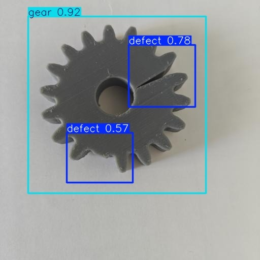

📌 YOLO-Based Object Detection System

Innovative Product Development Project

This repository contains a custom-trained YOLO object detection model developed as part of the Innovative Product Development project. The project focuses on real-time object detection using a webcam, demonstrating the complete workflow from dataset creation to model deployment.

🔍 Project Overview

Designed and trained a YOLO (You Only Look Once) model for real-time object detection

Built a custom dataset tailored to the project requirements

Implemented Python-based inference to run the trained model on a live webcam feed

🗂 Dataset Preparation

Images were manually annotated using Roboflow

Dataset includes 949 images after augmentation

Applied augmentation techniques such as:

Rotation

Scaling

Flipping

Brightness and contrast adjustments

These steps improved model robustness and generalization to real-world scenarios.

🧠 Model Training

Trained using the YOLO architecture for efficient and high-speed detection

Optimized for real-time performance with acceptable accuracy

Final trained weights are included in this repository

90% is train set and 10% is test set

🎥 Real-Time Inference

Python script provided to:

Load the trained YOLO model

Access the system webcam

Perform real-time object detection

Display bounding boxes and confidence scores

🛠 Technologies Used

Python

YOLO (Object Detection Framework)

OpenCV

Roboflow (Dataset annotation and augmentation)

🚀 Getting Started

Clone the repository

Install the required dependencies

Run the webcam inference script to see the model in action

📄 Notes

This project demonstrates an end-to-end computer vision pipeline, covering:

Dataset creation

Data preprocessing and augmentation

Model training

Deployment for real-time inference

It serves as a strong foundation for extending the system to industrial, surveillance, or smart automation applications.
